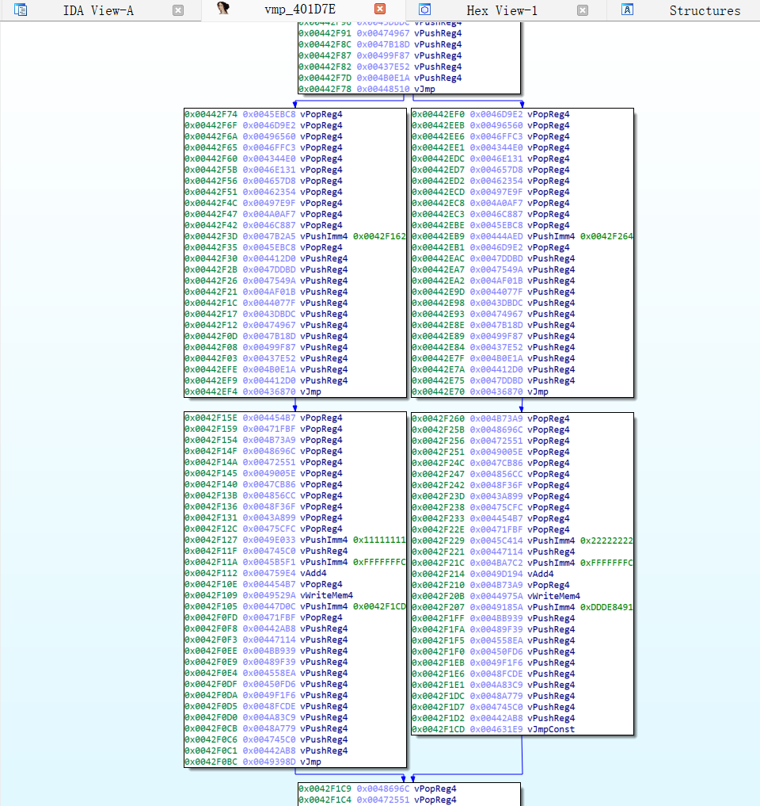

# VmpHelper

a vmp-analysis ida-plugin based on Ghidra, currently under development...

only supports Vmp3.5 x86

## How to use

1、Place the Ghidra directory and Revampire.dll into the IDA plugin directory

2、Use ida to load demo.exe.

At 00401D7E，right click to pop up menu -> Revampire -> Mark as VmEntry

3、At 00401D70，right click to pop up menu -> Revampire -> Execute Vmp 3.5.0.

Then you may get a flow chart like the following:

## Reference

ghidra:https://github.com/NationalSecurityAgency/ghidra

unicorn:https://github.com/unicorn-engine/unicorn

capstone:https://github.com/capstone-engine/capstone

keystone:https://github.com/keystone-engine/keystone

z3:https://github.com/Z3Prover/z3

开发者交流QQ群:569821835

## Sponsor this project

